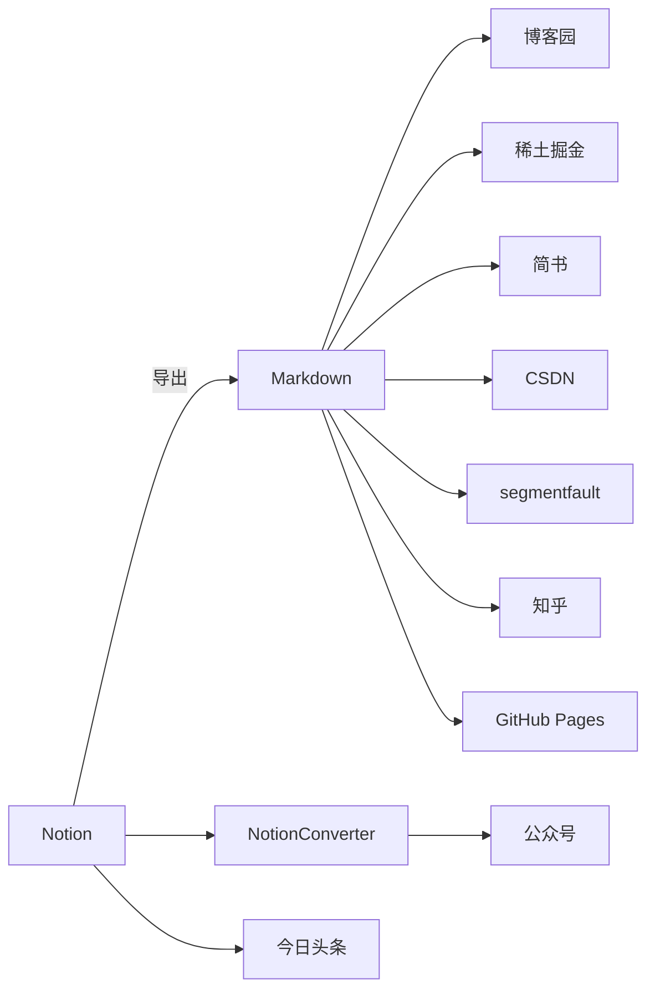

# 使用Notion写博客

本文总结最近了写博客的经验，如果你同样在写博客，或者需要一款知识管理软件，本文或许能有所帮助。

先上图，下面流程图是画的我文章发布流程，Notion有着关键作用。

### 我为什么使用Notion写内容

1.Notion支持Markdown。现在大部分博客平台支持使用Markdown格式写文章，Markdown格式表现力强，代码高亮显示，相比纯文本能保留代码格式，一开始我写的时候，会对代码部分直接截图，导致文章内图片较多，大部分博客平台对图片外链支持并不友好，如果图片太多，发布时图片需手动重新上传一次，比较繁琐，像代码放在Markdown格式的代码块中，能一定程度减少图片使用。

2.使用NotionConverter浏览器插件一键将Notion内容转为微信公众号格式。登录Notion网页版，找到对应文章，点击插件就能一键转换完成，有多种格式可以选择，默认格式是免费的，更好看的格式是收费的，图片都能直接转为公众号链接，无需再过多调整格式，默认格式已满足要求。

3.所见即所得的编辑界面，无需记忆复杂的Markdown语法。在Notion中正常写内容即可，能直接导出为Markdown格式，再用导出的Markdown文件发布到多个平台即可，相当于Markdown的可视化操作。

### 文章发布流程

目前我是将文章发布到了多个平台，包括公众号、博客园、稀土掘金、简书、CSDN、segmentfault、知乎、今日头条和上期自建的GitHub Pages（如还有我忽略的技术类型平台，可以留言我加上），发布平台较多，微信公众号直接使用NotionConverter插件转换后的结果，今日头条不支持Markdown文件上传，是直接复制上去，其他平台都是通过Notion导出的Markdown文件上传，再少量修改就能发布了，能快速发布到多个平台。

### 什么是Notion

Notion是一款知识管理工具，基本文档和笔记管理，支持代码块，有浏览器插件支持网页剪切，可以将网页保存到Notion中，客户端跨平台支持，客户端数量不受限制，有丰富的模版，可以通过模版市场使用其他人共享的模版，待办事项、项目管理、个人记账理财、学习计划和规划等类型模版，我常用待办事项模版，有免费和收费的，支持团队协作与分享，可以嵌套，在现在AI时代，Notion也集成了AI，每月10刀，可以简单理解为是一款增强且功能丰富的电子笔记应用，之前我是使用印象笔记，现在主要使用Notion了，感兴趣的小伙伴可以体验一下。